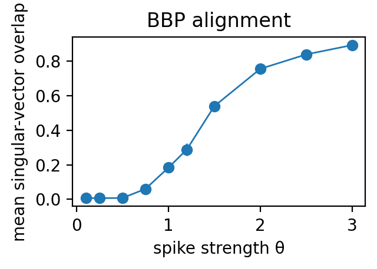
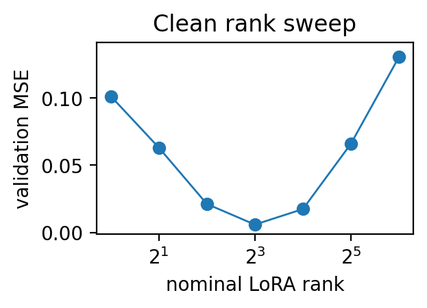
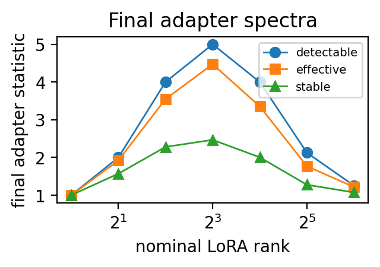
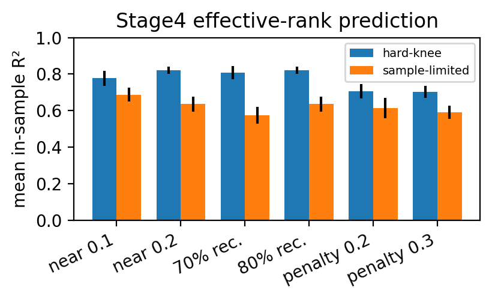
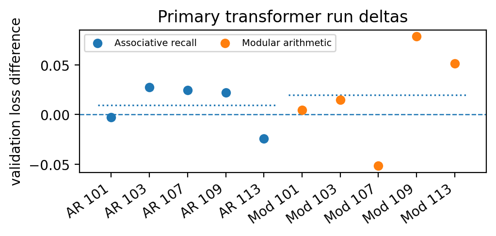

# Early Gradient Spectra and Useful Low-Rank Adaptation

Ruge Lin

> Research report, converted and audited 22 September 2026. Numerical results below describe the committed historical experiments; this cleanup did not rerun model training. See [the scientific audit](../docs/SCIENTIFIC_AUDIT.md) for the current evidence and novelty boundaries.

## Abstract

LoRA and related PEFT methods expose a nominal rank, but useful rank depends on the task spectrum seen through the model's activations.  For a frozen linear map with activation covariance `C` and task update `Δ★`, a classical reduced-rank approximation argument gives an optimum by truncating the SVD of `M★ = Δ★ C^(1/2)` and mapping back through `C^(−1/2)`. Its excess risk is `(1/2) Σ_(i>r) σ_i(M★)²`.  The activation-whitened population gradient at the frozen model has exactly this spectrum, making early-gradient spectra candidates for predicting useful adapter rank before training.  In five-seed matrix simulations, activation-whitened gradient effective rank predicts a plan-locked near-best useful-rank target with mean in-sample `R²=0.777` and mean Spearman correlation `0.852` in a hard-knee regime; the corresponding sample-limited values are `0.687` and `0.786`.  We then test the stronger extrapolation from rank prediction to cross-module allocation.  A plan-locked synthetic-transformer study with two task families and ten independent task–seed runs yields a null primary result for soft spectral dimension versus exact-cost uniform allocation: mean loss difference `+0.0146`, 95% task-stratified bootstrap interval `[-0.0078,0.0352]`, and exact two-sided sign-flip `p=0.2402`.  Separately, a checksum-bound GPT-2/Wikitext-2 study restricted to `c_attn` and `c_fc` modules finds a small but consistent improvement over exact-cost uniform rank 4 in all eight plan-locked primary seeds: mean paired loss difference `-0.0070`, bootstrap interval `[-0.0083,-0.0060]`, exact `p=0.0078`, and within-suite Holm-adjusted `p=0.0391`.  Adding attention output projections reverses direction in a three-seed boundary suite (`+0.0011`, 0/3 wins).  Thus early-gradient spectra predict useful rank and can support allocation in a controlled module scope, but the synthetic null, rank–scale sensitivity, and boundary reversal rule out a universal allocator claim.

**Scope and claim boundary.**

Most evidence is theorem-driven and synthetic.  The central empirical claim is useful-rank prediction in matrix simulations, not universal rank allocation in transformers.  The corrected synthetic-transformer experiment does not demonstrate an allocation advantage under its primary fixed-scale condition.  The real-model primary result is restricted to one frozen GPT-2 checkpoint, one dataset, one short-training protocol, and the plan-locked `c_attn/c_fc` module suite; its attention-output-projection boundary suite reverses direction.  We do not claim nonlinear transformer convergence, broad model or task generalization, or unconditional dominance of a spectral allocator.

## Introduction

Low-rank adaptation methods such as LoRA make rank a visible and tunable resource.  A rank-`r` LoRA adapter learns

```text
ΔW = (α/r) B A
```

with `B ∈ R^(d_out × r)` and `A ∈ R^(r × d_in)`.  In practice, however, nominal rank is an incomplete description of adaptation capacity.  Rank interacts with scale, optimization time, activation geometry, finite-sample noise, and the module on which the adapter is placed.  A rank that is algebraically available may not be functionally useful, and a small budget spent on the right module can outperform a larger budget spread uniformly.

We separate *nominal rank* from *useful rank*.  Nominal rank is the algebraic rank supplied to the adapter.  Useful rank is the smallest rank satisfying a practical criterion: near-best validation loss, a fixed fraction of attainable improvement, or a rank-penalized tradeoff.  Our central observation is that useful rank is a spectral quantity in function space.  If `C` is the activation covariance and `Δ★` is the task update, the relevant operator is

```text
M★ = Δ★ C^(1/2)
```

This activation weighting discounts update directions that the model rarely uses.

We derive two exact population statements in a reduced-rank adaptation model. The approximation result is a direct application of classical reduced-rank regression and Eckart–Young–Mirsky [14, 15, 20], and the gradient identity follows by differentiation; neither is claimed as a new general theorem.  First, the best rank-`r` adapter is obtained by truncating the singular spectrum of `M★`.  Second, the early full gradient at the frozen model, after activation whitening, equals `-M★`.  Therefore, the useful-rank spectrum is visible before training an adapter.  We validate this prediction in controlled matrix simulations.  We then test a stronger, non-equivalent hypothesis: whether a scalar spectral score can allocate a fixed LoRA parameter budget across transformer modules.  A plan-locked ten-run study with exact-cost comparators and common random numbers does not show an advantage for the primary spectral allocator, and sitewise score–rank relationships reverse sign across the two task families.  This negative bridge result is informative because it separates theorem-supported rank prediction from a practical allocation heuristic that requires further structure.

**Contributions.**

1. We specialize classical reduced-rank approximation to adaptation: rank-`r` excess risk is the tail singular energy of `Δ★ C^(1/2)`.
1. We show that the activation-whitened population early gradient has the same spectrum as this task operator.
1. We define useful-rank targets–near-best, recovery, and penalized rank–that avoid the degeneracy of unconstrained best rank.
1. We validate useful-rank prediction in multi-seed spiked matrix simulations, where gradient effective rank strongly predicts practical rank targets.
1. We conduct a plan-locked synthetic-transformer allocation study with ten independent task–seed runs, exact-cost baselines, common random numbers, three adaptation replicates, and explicit scaling controls; its null primary result identifies a boundary between rank prediction and module allocation.
1. We conduct a checksum-bound GPT-2/Wikitext-2 study with eight plan-locked primary seeds, exact-cost and common-random-number controls, allocation-only adaptive baselines, and a separate three-seed module-family boundary suite; the primary gain is statistically resolved but practically small, and the boundary suite reverses direction.

## Related Work

**LoRA and PEFT.**

LoRA freezes pretrained weights and trains low-rank increments, giving strong fine-tuning performance with far fewer trainable parameters [1].  QLoRA backpropagates through quantized frozen models into LoRA adapters, making LoRA-style adaptation central to memory-efficient fine-tuning [2].  Our focus is orthogonal: how much low-rank capacity is useful, and how should it be allocated?

**Adaptive rank and scaling.**

AdaLoRA explicitly reallocates rank budget across weight matrices using importance scores [3].  DyLoRA trains LoRA blocks over a range of ranks so that one checkpoint can expose multiple usable ranks without a separate exhaustive rank search [4].  Rank-stabilized LoRA changes the standard `α/r` scaling to mitigate high-rank learning issues [5].  DoRA decomposes weights into magnitude and direction and applies low-rank updates to the direction component [6].  These works motivate rank allocation and rank-scale disentanglement.  We study a pre-training spectral predictor of rank demand. Its novelty relative to existing gradient-based initialization and allocation methods remains to be established; the existing controlled experiments alone do not resolve that question.

**Data- and gradient-driven rank allocation.**

EVA uses activation singular vectors for LoRA initialization and redistributes rank according to explained activation variance [7].  GoRA combines gradient-driven rank adaptation with adaptive initialization [8], while FIM-LoRA allocates rank from calibration-time gradient variance on LoRA-`B` parameters [9].  ShapLoRA estimates rank importance with a Shapley-value-inspired sensitivity score on a validation set and an allocation–retraining workflow [10].  Our GPT-2 comparisons isolate allocation rather than reproduce these full methods: the EVA-, GoRA-, and FIM-LoRA-style controls use their corresponding score families but share the same nested initialization, exact parameter cost, stochastic streams, optimizer, and training schedule as every other strategy.

**Gradient subspaces and spectral perturbation.**

LoRA-One studies one-step full-gradient subspaces and shows that singular directions of the gradient can guide low-rank adaptation [11].  We examine within-site useful-rank prediction and the limits of transferring it to cross-module allocation. Neighboring subspace and adaptive-rank methods make a claim to the general idea of gradient-guided adaptation inappropriate.  Xu et al. analyze LoRA learning dynamics for matrix factorization under gradient flow, emphasizing initialization-dependent convergence and spectral initialization guarantees [12].  The reduced-rank calculation identifies the useful-rank spectrum through the activation-whitened population gradient.  Mathematically, we build on Eckart–Young–Mirsky low-rank approximation [14, 15], classical perturbation theory [16], and spiked random-matrix transitions [19].  Pythia is a natural future open-model validation suite because it provides controlled checkpoints across scale and training time [13]; we do not use it in this paper.

## Theory

Let

```text
y = (W₀ + Δ★)x + ξ
E[x] = 0; E[xxᵀ] = C ≻ 0; E[ξ | x] = 0
```

Assume finite second moments so that the stated risks exist. A rank-constrained adapter predicts `(W_0+Δ)x` with `rank(Δ)≤ r`, and

```text
L(Δ) = (1/2) E[‖y − (W₀ + Δ)x‖₂²]
```

Define `M★ = Δ★ C^(1/2)`.

**Population reduced-rank adaptation (classical corollary).**

Let `M★ = UΣVᵀ` with singular values `σ₁ ≥ σ₂ ≥ …`.  One best rank-`r` adapter is

```text
Δ★_r = U_r Σ_r V_rᵀ C^(−1/2)
```

Tied singular values can make the minimizer nonunique. Its excess risk is

```text
L(Δ★_r) − L(Δ★) = (1/2) Σ_{i>r} σ_i(M★)²
```

The smallest rank recovering fraction `ρ` of the attainable improvement is

```text
r_rec(ρ) = min {r : Σ_{i≤r} σ_i(M★)² ≥ ρ Σ_i σ_i(M★)²}
```

**Early-gradient identity.**

Let `G₀ = ∇_Δ L(0)`.  Then

```text
G₀ = −Δ★ C
−G₀ C^(−1/2) = Δ★ C^(1/2) = M★
```

Thus the activation-whitened population gradient has the complete spectrum determining rank-constrained approximation error in this linear, additive-teacher, squared-loss model. This is the full weight gradient, not the gradient of zero-initialized LoRA factors. The identity is not an exact model for a nonlinear transformer loss.

**Predictors.**

We compare hard detectable rank, stable rank, effective rank, and soft spectral dimensions.  The strongest replicated predictor is effective rank:

```text
r_eff(A) = exp(−Σ_i p_i(A) log p_i(A))
p_i(A) = σ_i(A)² / ‖A‖_F²
```

Here effective rank means entropy of normalized **squared** singular values. It is a summary of the spectrum, not a sufficient statistic for every recovery-rank target: different energy distributions can have the same entropy and different cumulative-energy thresholds. The formula applies to nonzero matrices with the convention `0 log 0 = 0`; code treats an all-zero spectrum as effective rank zero.

A threshold-aware continuous alternative is

```text
d_(φ,τ)(A) = Σ_i φ(σ_i(A)² / τ²)
```

Hard detectable rank corresponds to the discontinuous gate `φ(t) = 1 if t > 1, and 0 otherwise`.

**Finite samples.**

With empirical gradient `Ĝ₀`, ideal whitening gives `M̂ = −Ĝ₀ C^(−1/2) = M★ + E`.  If `‖E‖_op ≤ ε`, Weyl's inequality controls singular values.  Hard thresholding is stable only with a gap around the edge. Effective rank is continuous on nonzero, fixed-dimension matrices under vanishing relative Frobenius perturbations; this alone gives no dimension-free or sample-complexity guarantee.  In practice we use regularized empirical whitening:

```text
M̂_λ = −Ĝ₀ (Ĉ + λI)^(−1/2)
```

This regularized empirical operator is not generally equal to `M★`. Covariance estimation error, ridge bias, and diagonal whitening require their own analysis. No finite-sample guarantee for the practical transformer predictor is established here.

## Experimental Setup

The matrix and small-transformer experiments are synthetic and require no external datasets.  The final GPT-2/Wikitext-2 study uses checksum-pinned local model and dataset files and executes offline to test whether the diagnostic survives one real pretrained-transformer setting.  The goal is to separate useful-rank prediction from cross-module allocation under controlled task spectra, sample noise, rank grids, scale choices, stochastic streams, and exact parameter costs.  The experimental-settings table summarizes the experimental regimes.

| Experiment | Regime | Sweep | Purpose |
| --- | --- | --- | --- |
| BBP | m = n = 128, rank-1 spike | Spike strength θ | Spectral detectability transition |
| LoRA rank | d_in = d_out = 128, task rank 8 | Ranks 1–64 | Nominal rank and final adapter spectra |
| Alpha / rank-alpha | Noisy or rank-8 tasks | α and rank grids | Rank, scale, and instability |
| Merge/conflict | Paired task vectors | Overlap/sign sweeps | Signed versus unsigned interference |
| Layerwise hard-knee | 48 synthetic layers | Ranks 1–32 | Useful-rank prediction |
| Layerwise sample-limited | Fewer samples and more noise | Ranks 1–32 | Finite-sample degradation |
| Stage4 replication | 5 seeds × 2 regimes | 48 layers per seed | Replication within the simulation design |
| Synthetic transformer | 2 tasks × 5 seeds; 3 adaptation replicates | Ranks 0–16, 3 scale rules, exact costs | Transfer from rank prediction to allocation |
| GPT-2/Wikitext-2 | 8 primary + 3 boundary seeds | Six exact-cost strategies; fixed scale and controlled streams | Restricted-scope transfer and module-family boundary |

Experimental settings.  Stage4 is the primary evidence for early-gradient useful-rank prediction.

**Synthetic regression.**

Tasks use `y=(W_0+Δ★)x+ξ`.  Default dimensions are `d_in=d_out=128` with power-law activation covariance.  The main task-rank-8 spike values are

```text
(2.8, 2.2, 1.8, 1.45, 1.1, 0.85, 0.65, 0.5)
```

LoRA factors are trained by gradient descent with clipping.  Detection thresholds use a permutation null at quantile `0.995`.

**Useful-rank targets.**

Let `R` be the tested nominal-rank grid.  For validation curve `V(r)`, define `V_0=V(0)`, `V_min = min_(r ∈ R) V(r)`, `Δ V=V_0-V_min`, and `Q(r)=(V_0-V(r))/Δ V`.  When `Δ V>0`, we report

```text
r_near(γ) = min {r ∈ R : V(r) ≤ V_min + γ ΔV}
r_rec(ρ) = min {r ∈ R : Q(r) ≥ ρ}
r_pen(λ) = argmin_{r ∈ R} [V(r) + λ ΔV r/r_max]
```

Ties are resolved in favor of the smallest nominal rank.  Curves with `Δ V≤0` have undefined useful-rank targets and are excluded from target fits.  The simulation oracle loss is retained only as a diagnostic and never enters `V_min`, `Δ V`, a threshold, or a penalty.  The unconstrained observed-best rank is likewise diagnostic; in layerwise experiments it is often the largest rank tested.

## Results

### Detectability and nominal-rank failures

The BBP-style simulation confirms the expected detectability transition (the first detectability and rank-sweep figure).  In rank-1 Gaussian noise with edge near `2.0`, planted/empirical overlap is near zero for small spikes and rises after spectral separation: mean overlap is about `0.008` at `θ=0.1`, `0.288` at `θ=1.2`, `0.540` at `θ=1.5`, and `0.893` at `θ=3.0`.







First: BBP detectability transition. Second: a clean fixed-`α` LoRA rank sweep is U-shaped, so nominal rank is not the explanatory variable.  Third: final adapter spectral statistics peak near the useful-rank range.

The rank-sweep panels in the detectability and rank-sweep figures show why nominal rank alone is insufficient.  A cleaned fixed-`α` LoRA sweep with `α=16`, learning rate `0.2`, 1200 steps, ranks `1`–`64`, and 8 repetitions shows a U-shaped curve.  Mean validation loss is `0.1011` at rank 1, `0.0211` at rank 4, `0.0058` at rank 8, `0.0174` at rank 16, and `0.1303` at rank 64.  Robust fits show that final adapter stable/effective/detectable rank explain validation loss far better than nominal rank.

### Rank and scale are confounded

Alpha controls both optimization and drift.  In the alpha stress run, validation loss improves up to moderate `α` and then degrades mildly, while the output-drift proxy increases.  Large `α` did not robustly create separate “intruder” directions in this synthetic setting; the safer interpretation is amplification and drift.  A rank-alpha grid further shows that nominal rank alone is weak: on the clean subset with validation loss `<1`, adapter stable rank reaches `R²≈0.810` for log validation loss, adapter detectable rank plus alpha reaches `R²≈0.778`, adapter effective rank reaches `R²≈0.740`, alpha alone reaches `R²≈0.552`, and nominal rank alone reaches only `R²≈0.040`.

### Signed conflict is secondary but informative

The original unsigned merge-overlap experiment was weak: spectral interference explained only about `R²=0.051` for merge degradation and planted overlap about `R²=0.046`.  A corrected signed-conflict experiment gave a clearer story: the signed task inner product explains merge degradation with `R²=0.9995`, while a conflict score gives `R²=0.747` and unsigned overlap alone gives `R²=0.085`.  This is a secondary result; it supports using signed spectral geometry rather than unsigned overlap for task-vector interference.

### Stage4: early-gradient effective rank predicts useful rank

The main matrix-simulation evidence is the Stage4 replication: five seeds per condition and 48 synthetic layers per seed.  For each layer, we compute activation-whitened early-gradient spectral statistics, run rank sweeps over `{1,2,4,8,16,32}`, and evaluate useful-rank targets.  The archived protocol records that, after pilot-informed development and before the corrected rerun, the study froze the hard-knee `r_near(0.1)` versus activation-whitened gradient effective-rank comparison as the primary pair; its sample-limited counterpart is a plan-locked robustness check.  Other displayed targets and all alternative predictors are secondary or exploratory.  The Stage4 figure and the Stage4 table report the replicated activation-whitened effective-rank predictor.  The reported Stage4 `R²` values are in-sample fits over layer-level targets; corresponding leave-one-out values for the primary hard-knee and sample-limited rows are `0.7547` and `0.6617`, respectively.



Stage4 replication.  Bars show mean in-sample `R²` over 5 seeds for activation-whitened gradient effective rank predicting log2 useful-rank targets.  Hard-knee spectra are strongly predicted; sample-limited spectra are weaker but still informative.

[Stage4 effective-rank results](tables/generated/stage4_rows.md)

<!-- generated-table: stage4_rows.md -->
| Condition | Target | Mean in-sample R² (SEM) | Mean Spearman ρ (SEM) |
| --- | --- | --- | --- |
| Hard-knee | near-best 0.1 gap | 0.777 (0.041) | 0.852 (0.017) |
| Hard-knee | near-best 0.2 gap | 0.821 (0.020) | 0.868 (0.013) |
| Hard-knee | 70% recovery | 0.808 (0.035) | 0.872 (0.019) |
| Hard-knee | 80% recovery | 0.821 (0.020) | 0.868 (0.013) |
| Hard-knee | penalty 0.2 | 0.707 (0.039) | 0.804 (0.030) |
| Hard-knee | penalty 0.3 | 0.703 (0.034) | 0.811 (0.023) |
| Sample-limited | near-best 0.1 gap | 0.687 (0.038) | 0.786 (0.026) |
| Sample-limited | near-best 0.2 gap | 0.635 (0.042) | 0.766 (0.030) |
| Sample-limited | 70% recovery | 0.573 (0.046) | 0.731 (0.039) |
| Sample-limited | 80% recovery | 0.635 (0.042) | 0.766 (0.030) |
| Sample-limited | penalty 0.2 | 0.614 (0.055) | 0.740 (0.040) |
| Sample-limited | penalty 0.3 | 0.591 (0.036) | 0.720 (0.019) |
<!-- end-generated-table: stage4_rows.md -->

Stage4 activation-whitened effective-rank results.  Mean over five seeds; SEM in parentheses.

The hard-knee regime uses `n_train=1024`, label noise `0.05`, and weak-factor range `0.01`–`0.08`.  The sample-limited regime uses `n_train=384`, label noise `0.12`, and weak-factor range `0.05`–`0.25`.  The unconstrained best rank is degenerate: rank 32 is best for almost every layer.  Useful-rank targets are nondegenerate and predictable.

## Synthetic-Transformer Allocation Test

We next test a stronger claim than the matrix theorem: whether modulewise early-gradient spectra can allocate a limited LoRA budget inside a nonlinear transformer.  The archived plan records a freeze before the full run; this study is conditional on two named synthetic task families.  Each independent unit is one task/base-model seed run; budgets and adaptation replicates are nested observations rather than additional independent samples.

**Model, tasks, and calibration.**

Each run trains a two-layer decoder-only transformer with `d_model=64`, four attention heads, MLP width 128, and zero dropout on a base task, freezes it, and adapts to a shifted task.  Modular arithmetic changes an offset under modulus 31 and exposes eight `q`, `v`, `o`, and MLP-output sites.  Associative recall changes a 16-key mapping and exposes ten sites, additionally including `k` projections.  For site `j`, hooks estimate

```text
Ĉ_j = (1/N_j) Σ_{b,a} x_(j,b,a) x_(j,b,a)ᵀ
Ĝ_j = (1/B_j) Σ_b Σ_a g̃_(j,b,a) x_(j,b,a)ᵀ
```

and form `M̂_(j,λ) = −Ĝ_j (Ĉ_j + λ_j I)^(−1/2)` with diagonal whitening and `λ_j = 0.01 tr(Ĉ_j)/d_j`.  Calibration uses eight batches of size 128, 4,096 permutation-null maxima per site, a 0.995 edge quantile, and 2,000 edge-uncertainty resamples.  Rank sweeps use `{0,1,2,4,8,16}`.

**Plan-locked comparison and controls.**

The primary allocation rule is soft spectral dimension under fixed update scale, compared with a deterministic uniform allocation constructed at the same realized trainable-parameter cost for every candidate allocation.  Standard `α/r` and rsLoRA are separate sensitivity conditions.  Adapter initialization, training batches, evaluation examples, and all declared random streams are shared across paired rules.  Modular arithmetic is evaluated exhaustively.  Each budget has three adaptation replicates; the six modular and seven associative-recall budgets are first averaged within a task–seed run.  Five independent seeds per task are then averaged within task, and the primary omnibus estimate weights the two task means equally.  Inference uses 10,000 within-task run bootstrap resamples and an exact two-sided task-stratified sign-flip test over all `2¹⁰` patterns; the exact test conditions on the observed magnitudes and assumes sign exchangeability of paired run effects under the null.



Primary synthetic-transformer run effects.  Each point is one independent task–seed run after averaging three adaptation replicates and the plan-locked budgets.  The outcome is final-validation-loss `Δ=` soft dimension minus its exact-cost uniform comparator, so positive values favor uniform allocation.  Dotted segments are task means; the dashed line is zero.

[Synthetic-transformer primary comparison](tables/generated/transformer_primary_rows.md)

<!-- generated-table: transformer_primary_rows.md -->
| Analysis | Runs | Mean loss Δ | 95% CI | Exact p | Runs better | Mean accuracy Δ |
| --- | --- | --- | --- | --- | --- | --- |
| Omnibus (equal task weight) | 10 | +0.0146 | [-0.0078, +0.0352] | 0.2402 | 3/10 | -0.0039 |
| Associative recall | 5 | +0.0095 | [-0.0102, +0.0253] | 0.4375 | 2/5 | -0.0015 |
| Modular arithmetic | 5 | +0.0198 | [-0.0197, +0.0553] | 0.3750 | 1/5 | -0.0064 |
<!-- end-generated-table: transformer_primary_rows.md -->

Plan-locked fixed-update-scale transformer comparison.  Positive loss `Δ` means the soft-dimension candidate is worse than exact-cost uniform allocation.  The omnibus interval resamples independent runs within task and weights task means equally; `p` values are exact two-sided sign-flip tests under sign exchangeability.  Task-specific rows are secondary and have five-run resolution.

**Primary result.**

The independent-run figure and the primary-comparison table do not support an allocation advantage.  The equal-task-weighted loss difference is `+0.0146` (95% CI `[-0.0078,0.0352]`, exact `p=0.2402`), with 3/10 run wins and 0/2 task-family mean wins.  The mean accuracy difference is `-0.0039`.  Associative recall has mean loss `Δ=+0.0095` and modular arithmetic `+0.0198`; both intervals include zero.  The release contains 2,925 exact-cost candidate pairs, no realized-cost mismatch, no paired-seed disagreement, no divergent row, and zero metric spread among identical allocations, so the null result is not explained by the randomization and cost defects that invalidated the earlier analysis.

[Scaling sensitivity](tables/generated/transformer_scaling_rows.md)

<!-- generated-table: transformer_scaling_rows.md -->
| Scaling | Role | Omnibus loss Δ | Exact p | Runs better | Associative Δ | Modular Δ |
| --- | --- | --- | --- | --- | --- | --- |
| Fixed update scale | Primary | +0.0146 | 0.2402 | 3/10 | +0.0095 | +0.0198 |
| Standard α/r | Exploratory | -0.0340 | 0.1973 | 6/10 | -0.0293 | -0.0388 |
| rsLoRA | Exploratory | +0.0113 | 0.4609 | 3/10 | -0.0004 | +0.0231 |
<!-- end-generated-table: transformer_scaling_rows.md -->

Scaling sensitivity for soft dimension versus exact-cost uniform allocation.  Fixed update scale is primary; standard `α/r` and rsLoRA are exploratory.  Negative loss `Δ` favors the spectral candidate.  None of the exact two-sided tests reaches 0.05.

**Scaling and task heterogeneity.**

The scaling-sensitivity table shows that the direction changes with the LoRA scaling rule.  Under standard `α/r`, the exploratory mean is `-0.0340` with 6/10 run wins and both task means negative, but the exact `p` value is `0.1973`; rsLoRA is near zero overall.  This is evidence of rank–scale sensitivity, not evidence for selecting the most favorable condition after observing outcomes.

[Sitewise associations](tables/generated/transformer_sitewise_rows.md)

<!-- generated-table: transformer_sitewise_rows.md -->
| Task | Predictor | Mean Spearman ρ | SEM |
| --- | --- | --- | --- |
| Associative recall | Effective rank | -0.473 | 0.057 |
| Associative recall | Soft dimension | -0.476 | 0.063 |
| Modular arithmetic | Effective rank | +0.292 | 0.183 |
| Modular arithmetic | Soft dimension | +0.304 | 0.179 |
<!-- end-generated-table: transformer_sitewise_rows.md -->

Sitewise association between spectral score and the near-best 0.1-gap useful-rank target under fixed update scale.  Values are mean Spearman correlations over five independent runs, with SEM.

The sitewise-association table further separates module importance from rank demand.  Effective rank and soft dimension correlate positively with useful rank in modular arithmetic but negatively in associative recall.  A module can have a strong early-gradient spectrum yet achieve most of its attainable gain at low rank; a scalar score need not simultaneously encode whether a site matters and how many directions it needs.

**Superseded analyses.**

The former six-cluster, 39-budget “33/39 wins” summary and its one-seed-per-task whitening ablation were generated before common-random-number and exact-cost controls.  They are not publication evidence, are not inputs to any current table or figure, and are omitted from the claims.  Whitening remains theoretically motivated, but its transformer allocation effect must be rerun under the corrected protocol.

## Real GPT-2/Wikitext Validation

The real-model study uses a checksum-pinned local GPT-2 checkpoint and local Wikitext-2 files [17, 18].  Each source run is executed offline and trains for 200 steps with block size 128, batch size 4, eight calibration batches, and 32 evaluation batches.  Calibration is dropout-free while retaining gradients.  Model, adapter, data, dropout, and evaluation random streams are named and separated; the training RNG is reset after allocation-dependent adapter construction.  All strategies use module-name-derived nested initialization, fixed update scale, and exactly matched trainable-parameter cost.  A duplicate-uniform identity control must match the uniform run in assignment, trace, final adapter state, and evaluation metrics, and every strategy must pass nonzero gradient and adapter-update gates.

The six paper-facing strategies are exact-cost uniform rank 4, activation-whitened spectral effective rank, gradient norm, and allocation-only EVA-, GoRA-, and FIM-LoRA-style controls.  The last three borrow only a scoring family from the corresponding method; they are not full reproductions of those methods' initialization or training algorithms.  The plan-locked primary suite adapts GPT-2 `c_attn` and `c_fc` modules over eight independent base seeds.  A separate three-seed boundary suite adds `attn.c_proj`; it is not pooled with the primary analysis.

[GPT-2/Wikitext-2 allocation results](tables/generated/real_lora_rows.md)

<!-- generated-table: real_lora_rows.md -->
| Setting | Strategy | Final validation loss (SEM) | Loss Δ vs uniform | Bootstrap 95% CI | Wins |
| --- | --- | --- | --- | --- | --- |
| c_attn, c_fc | spectral effective | 3.4513 (0.0010) | -0.0070 | [-0.0083, -0.0060] | 8/8 |
| c_attn, c_fc | EVA-style allocation | 3.4537 (0.0012) | -0.0046 | [-0.0049, -0.0043] | 8/8 |
| c_attn, c_fc | uniform rank 4 | 3.4583 (0.0012) | 0 (reference) | — | — |
| c_attn, c_fc | GoRA-style allocation | 3.4610 (0.0011) | +0.0027 | [+0.0022, +0.0032] | 0/8 |
| c_attn, c_fc | gradient norm | 3.4857 (0.0011) | +0.0275 | [+0.0262, +0.0285] | 0/8 |
| c_attn, c_fc | FIM-LoRA-style allocation | 3.4996 (0.0015) | +0.0413 | [+0.0385, +0.0445] | 0/8 |
| + attn.c_proj | spectral effective | 3.4455 (0.0011) | +0.0011 | [+0.0009, +0.0013] | 0/3 |
| + attn.c_proj | EVA-style allocation | 3.4506 (0.0013) | +0.0062 | [+0.0061, +0.0063] | 0/3 |
| + attn.c_proj | uniform rank 4 | 3.4444 (0.0012) | 0 (reference) | — | — |
| + attn.c_proj | GoRA-style allocation | 3.4655 (0.0012) | +0.0211 | [+0.0205, +0.0218] | 0/3 |
| + attn.c_proj | gradient norm | 3.4693 (0.0020) | +0.0249 | [+0.0238, +0.0266] | 0/3 |
| + attn.c_proj | FIM-LoRA-style allocation | 3.4783 (0.0027) | +0.0339 | [+0.0310, +0.0367] | 0/3 |
<!-- end-generated-table: real_lora_rows.md -->

Controlled GPT-2/Wikitext-2 allocation study.  Final validation loss is mean over independent seeds with SEM in parentheses.  Loss differences are candidate minus exact-cost uniform rank 4, so negative is better.  Intervals are deterministic run-level bootstrap 95% intervals; wins count lower-loss runs versus uniform.  Every strategy has exactly 331,776 trainable parameters in the primary suite and 405,504 in the boundary suite.

In the plan-locked `c_attn,c_fc` primary suite, spectral-effective allocation has mean final validation loss `3.4513` (SEM `0.0010`), versus `3.4583` (`0.0012`) for exact-cost uniform rank 4.  The paired mean difference is `-0.007026` with bootstrap 95% interval `[-0.008343,-0.006026]`, and spectral allocation wins all eight seeds.  The exact two-sided sign-flip test gives `p=0.0078125`; with eight nonzero paired differences this is the minimum attainable two-sided value under the sign-exchangeability null.  Adjustment across the five plan-locked within-suite candidate comparisons gives Holm `p=0.0390625`.  The absolute effect is small: the loss change corresponds to about `0.70%` lower perplexity and about `1.43%` of the improvement of exact-cost uniform rank 4 over the frozen model.  EVA-style allocation is also better than uniform in all eight seeds (`-0.004610`, interval `[-0.004911,-0.004315]`), but spectral allocation has the lower mean loss.  GoRA-style, gradient-norm, and FIM-LoRA-style allocations are worse than uniform by `+0.002683`, `+0.027467`, and `+0.041326`, respectively, under this common protocol.

The boundary suite reverses the primary direction.  After adding `attn.c_proj`, spectral-effective allocation is worse than uniform in all three seeds: mean difference `+0.001087` with bootstrap interval `[0.000873,0.001330]`.  The exact two-sided sign-flip value is `p=0.25`, the minimum attainable with three nonzero paired differences, so this suite is descriptive rather than a separately powered primary test.  All other nonuniform controls also lose all three boundary runs.  This scope sensitivity is consistent with the allocator concentrating rank on the newly eligible attention-output family; it motivates module-family constraints or normalization rather than a universal scalar allocation rule.

## Rank Allocation Algorithm

The transformer experiments implement the following plug-in rule.  For every candidate site `j`, compute the regularized whitened early gradient `M̂_(j,λ)`.  Let `S_j` be a scalar spectral score such as `r_eff(M̂_(j,λ))` or `d_(φ,τ̂_j)(M̂_(j,λ))`.  A simple allocator chooses

```text
r_j(κ) = Π_(R_j)(κ S_j)
Σ_j c_j r_j(κ) ≤ B
```

where `c_j = d_(j,in) + d_(j,out)` and `κ` is calibrated to the budget.  A marginal-gain allocator instead estimates gains

```text
b̂_(j,i) = (1/2) σ̂_(j,i)²
or
b̂_(j,i) = (1/2) max(σ̂_(j,i)² − τ̂_j², 0)
```

and uses the gain-to-cost ratio `b̂_(j,i)/c_j` as a heuristic priority. In a collection of **independent sites with additive quadratic loss**, each population singular direction reduces risk by `(1/2) σ_(j,i)²` at cost `c_j`. Selecting the largest gains is exact when all per-direction costs are equal, subject to the rank budget and appropriate tie handling. With unequal costs and integer ranks, the allocation is a knapsack problem; a single ratio threshold is not an exact solver. For example, directions with (cost, gain) equal to (2, 3) and (3, 4), under budget 3, lead a density-first rule to gain 3 although gain 4 is feasible. A fractional relaxation can use a threshold with a partially selected boundary item.

Neither additive independent-site loss nor fractional directions describe general LoRA placement in a nonlinear transformer. The released transformer experiment also does not validate the proportional soft-dimension rule as a universal allocator.  A practical method must distinguish site importance from within-site rank demand, retain exact-cost uniform and gradient-based baselines, prespecify the LoRA scaling rule, and likely normalize or constrain allocations by module family.  We therefore present these equations as a theory-motivated design family rather than as a supported production algorithm.

## Future Validation Targets

The next study should expand both task families and pretrained checkpoints while separating two predictions: a site's attainable adaptation gain and the rank needed to recover that gain.  Allocation rules should be externally preregistered or otherwise plan-locked before observing validation outcomes, with module-family constraints, exact realized-cost matching, fixed stochastic streams, and a single primary scaling convention.  Power should be based on independent model–task–seed runs, not nested budgets or adaptation replicates.  The restricted-scope GPT-2 result should be replicated on several datasets and model families, with the attention-output boundary failure treated as a design target rather than averaged away.

## Discussion

The strongest result is the reduced-rank connection between activation-weighted task spectra, early gradients, and useful rank.  The five-seed matrix study supports that connection under both hard-knee and sample-limited regimes.  Allocation is a distinct question.  The synthetic-transformer study supplies a useful falsification under its primary condition, whereas the controlled GPT-2 study supplies positive evidence within one plan-locked module scope.  The real-model boundary reversal shows why these results are compatible: a spectral score can be useful without defining a module-family-invariant budget rule.

**Limitations.**

The theorem is linear reduced-rank adaptation, not nonlinear transformer optimization.  Stage4 is synthetic and uses 48 simulated layers per seed.  The synthetic-transformer allocation inference is conditional on only two named task families and ten independent runs; its exploratory scaling results are not multiplicity-adjusted primary tests.  The real study uses one GPT-2 checkpoint, one dataset, restricted target modules, short training, and fixed update scale.  Its eight-seed primary inference is resolved for that frozen protocol, but it does not establish transfer across checkpoints, datasets, module families, training horizons, or scaling conventions.  The three-seed boundary suite has exact-test resolution only `0.25`.  The EVA-, GoRA-, and FIM-LoRA-style rows isolate allocation scores and must not be read as full-method benchmarks.

**Claim boundary.**

The supported claim is that activation-whitened early-gradient spectra predict useful rank in the reduced-rank model and controlled spiked matrix simulations.  Under one checksum-bound GPT-2/Wikitext-2 protocol, spectral-effective allocation also beats an exact-cost uniform baseline for the plan-locked `c_attn/c_fc` module suite.  The current evidence does not establish that the same scalar score should determine budgets across arbitrary module families: the synthetic primary result is null and the real-model attention-output boundary reverses direction.

## Conclusion

Useful low-rank adaptation is governed by activation-weighted task spectra in the reduced-rank population model, and early gradients reveal those spectra before adapter training.  Multi-seed matrix simulations support prediction of practical useful-rank targets.  Allocation evidence is conditional: the plan-locked synthetic-transformer comparison is null, while the controlled GPT-2 `c_attn/c_fc` comparison is positive and statistically resolved.  Its attention-output boundary reverses direction.  Early-gradient spectra are therefore a principled diagnostic and a promising scoped allocator, but a reliable cross-module rule requires explicit module-family structure and broader replication.

## Reproducibility Statement

All experiments write machine-readable metrics, frozen configurations, and provenance records.  The corrected Stage4 table is imported from a five-seed release by `Paper/import_stage4_aggregate.py`.  Corrected transformer tables are imported by `Paper/import_transformer_publication.py`, which verifies checksums, reconstructs ten primary run effects from exact-cost rows, and recomputes the primary inference.  The real-model release `real_lora_publication_20260623T074520Z` is imported by `Paper/import_real_lora_results.py`.  That importer verifies the archive and recursive manifests, rejects stale plans or protocol versions, reconstructs all 55 paired candidate effects from 11 source runs, checks exact cost, stochastic identity controls, and adapter activity, and recomputes deterministic bootstrap, exact sign-flip, and Holm-adjusted statistics.  Immutable release and plan hashes are recorded in the corresponding `source.json` files. Hashes bind content; they do not independently establish that a plan was publicly registered before outcomes were seen. “Plan-locked” describes the archived protocol; “confirmatory” is retained as a historical machine-readable analysis label. Neither establishes an independently verified preregistration history.  `Paper/make_paper_artifacts.py` accepts only these checksum-bound post-correction tables; legacy real-model and pre-CRN transformer summaries are excluded from manuscript generation.  The lightweight code package indexes the full raw releases, pinned GPT-2/Wikitext-2 inputs, and Stage4 source sidecar in `RELEASE_ARTIFACTS.json`; those large companion files are separated from the manuscript source and repository checkout.

## Proofs and Additional Theory

**Proof of the population result.**

Using `y=(W_0+Δ★)x+ξ` and `E[ξ | x] = 0`,

```text
L(Δ) − L(Δ★) = (1/2) ‖(Δ★ − Δ) C^(1/2)‖_F²
```

Let `M=Δ C^(1/2)`.  Because `C^(1/2)` is invertible, `rank(M)=rank(Δ)`.  Hence the rank-`r` problem is

```text
min_{rank(M)≤r} (1/2) ‖M★ − M‖_F²
```

whose solution is the truncated SVD, by Eckart–Young–Mirsky [14, 15]. This supplies the claimed optimum and the tail-energy risk.

**Proof of the gradient identity.**

Differentiating the quadratic risk gives `∇L(Δ) = (Δ − Δ★)C`, because the conditional noise mean is zero. At `Δ = 0`, this is `G₀ = −Δ★C`; right multiplication by `C^(−1/2)` gives the displayed identity.

**Finite-sample perturbation.**

If `M̂=M★+E` and `‖E‖_op ≤ ε`, then
`|σ_i(M̂) − σ_i(M★)| ≤ ε`.  Hence the number
of empirical singular values above a threshold `τ` is trapped between the
number of population singular values above `τ+ε` and the number
above `τ-ε`.  This is the detectable-rank sandwich used to
explain why hard thresholds require a spectral gap around the edge.

**LoRA factorization bridge.**

For the following dynamics, assume Euclidean factor optimization is performed **in whitened coordinates**. Transforming coordinates changes the factor-gradient metric, so these are not automatically the dynamics of ordinary LoRA gradient descent under anisotropic activations. Write `M=sBA`, `s=α/r`, and `F(M) = (1/2) ‖M − M★‖_F²`.  The factorized global optimum equals the best rank-`r` approximation because `BA` represents any rank-`r` matrix.  With zero-`B` initialization, one gradient step gives

```text
M₁ = η s² M★ A₀ᵀ A₀
```

Thus the first LoRA step is a randomized spectral sketch of the task operator.  Under factor gradient flow,

```text
dB/dt = −s (M − M★) Aᵀ
dA/dt = −s Bᵀ (M − M★)
dM/dt = −s² [(M − M★) AᵀA + BBᵀ (M − M★)]
```

For one aligned mode with scalar factors `a_i,b_i`, `m_i=sa_ib_i`, and target singular value `σ_i`,

```text
dm_i/dt = s² (a_i² + b_i²) (σ_i − m_i)
```

Only on the balanced positive branch `a_i^2=b_i^2=m_i/s` does this reduce to `dm_i/dt = 2s m_i(σ_i − m_i)`.  Zero-`B` initialization is initially unbalanced: `m_i(0)=0` but `dm_i/dt at t = 0 equals s² a_i(0)² σ_i`, consistent with the one-step formula above.  The previously stated logistic equation is therefore a balanced special case, not the zero-`B` initialization dynamics.

## Reproducibility Details

The project generated archives for BBP, LoRA rank, alpha, merge, stage1b, stage2, stage3, Stage4, and transformer experiments.  Each run writes CSV metrics and provenance files.  The transformer publication design uses a two-layer decoder-only model with `d_model=64`, four heads, MLP width 128, diagonal whitening with `λ = 0.01 tr(Ĉ)/d`, ranks `{0,1,2,4,8,16}`, LoRA `α=16`, fixed-update-scale primary analysis, standard and rsLoRA sensitivities, five base seeds per task, and three adaptation replicates per budget.  Stage4 fits use

```text
log₂(r_target,j) = a + b log₂(1 + s_j) + ε_j
```

where `s_j` is a spectral score.  Main targets are `r_near(0.1)`, `r_near(0.2)`, `r_rec(0.7)`, `r_rec(0.8)`, `r_pen(0.2)`, and `r_pen(0.3)`.

**Release commands.**

From `Code/`, `make test` runs the lightweight code tests.  Stage4 smoke and publication releases use `run_stage4_smoke.sh` and `run_stage4.sh`; `make stage4-to-paper` imports only a validated five-seed release.  Transformer smoke and publication releases use `run_transformer_publication_smoke.sh` and `run_transformer_publication.sh`; `make transformer-to-paper` imports the corrected ten-run release.  Real-model inputs are materialized and hash-checked before the offline `run_real_lora_publication.sh` driver; `make real-lora-to-paper` verifies and imports the frozen 8+3 release.  `make report` validates the committed imported inputs and regenerates Markdown tables and PNG figures. It needs no typesetting compiler or model training. `make paper` remains a compatibility alias for `make report`. Refreshing imports from original experiments is a separate action requiring the indexed companion release files; artifact regeneration alone does not revalidate those absent raw inputs.

**Transformer inference resolution.**

The ten-run omnibus exact test enumerates 1,024 sign patterns under the task-stratified statistic and has nominal minimum nonzero two-sided resolution `2/1024=0.001953125`.  Each five-run task-specific test is secondary and has minimum two-sided resolution `2/32=0.0625`.  Budgets and adaptation replicates are averaged within their task–seed run and never counted as independent units.

## References

1. Edward J. Hu et al. LoRA: Low-Rank Adaptation of Large Language Models. *[arXiv:2106.09685](https://arxiv.org/abs/2106.09685)*, 2021.
2. Tim Dettmers et al. QLoRA: Efficient Finetuning of Quantized LLMs. *[arXiv:2305.14314](https://arxiv.org/abs/2305.14314)*, 2023.
3. Qingru Zhang et al. AdaLoRA: Adaptive Budget Allocation for Parameter-Efficient Fine-Tuning. *[arXiv:2303.10512](https://arxiv.org/abs/2303.10512)*, 2023.
4. Mojtaba Valipour, Mehdi Rezagholizadeh, Ivan Kobyzev, and Ali Ghodsi. DyLoRA: Parameter-Efficient Tuning of Pre-trained Models using Dynamic Search-Free Low-Rank Adaptation. *Proc. EACL*, pages 3274–3287, 2023.
5. Damjan Kalajdzievski. A Rank Stabilization Scaling Factor for Fine-Tuning with LoRA. *[arXiv:2312.03732](https://arxiv.org/abs/2312.03732)*, 2023.
6. Shih-Yang Liu et al. DoRA: Weight-Decomposed Low-Rank Adaptation. *[arXiv:2402.09353](https://arxiv.org/abs/2402.09353)*, 2024.
7. Fabian Paischer, Lukas Hauzenberger, Thomas Schmied, Benedikt Alkin, Marc Peter Deisenroth, and Sepp Hochreiter. [Parameter Efficient Fine-tuning via Explained Variance Adaptation](https://proceedings.neurips.cc/paper_files/paper/2025/hash/41d33bd41fd44bd9dba0e092047cf213-Abstract-Conference.html). *NeurIPS*, 2025.
8. Haonan He, Peng Ye, Yuchen Ren, Yuan Yuan, Luyang Zhou, Shucun Ju, and Lei Chen. [GoRA: Gradient-driven Adaptive Low Rank Adaptation](https://proceedings.neurips.cc/paper_files/paper/2025/hash/a5e4907a40c0dcb8433a35c714ba9d79-Abstract-Conference.html). *NeurIPS*, 2025.
9. Ramakrishnan Sathyavageeswaran. FIM-LoRA: Task-Informative Rank Allocation for LoRA via Calibration-Time Gradient-Variance Estimation. *[arXiv:2605.16800](https://arxiv.org/abs/2605.16800)*, 2026.
10. Yi Zhao, Qinghua Yao, Xinyuan Song, and Wei Zhu. ShapLoRA: Allocation of Low-rank Adaption on Large Language Models via Shapley Value Inspired Importance Estimation. *[arXiv:2601.17921](https://arxiv.org/abs/2601.17921)*, 2026.
11. Yuanhe Zhang, Fanghui Liu, and Yudong Chen. [LoRA-One](https://proceedings.mlr.press/v267/zhang25ax.html). *ICML*, 2025.
12. Ziqing Xu, Hancheng Min, Lachlan Ewen MacDonald, Jinqi Luo, Salma Tarmoun, Enrique Mallada, and Rene Vidal. Understanding the Learning Dynamics of LoRA: A Gradient Flow Perspective on Low-Rank Adaptation in Matrix Factorization. *Proc. AISTATS, PMLR 258*, pages 4636–4644, 2025.
13. Stella Biderman et al. Pythia: A Suite for Analyzing Large Language Models Across Training and Scaling. *[arXiv:2304.01373](https://arxiv.org/abs/2304.01373)*, 2023.
14. Carl Eckart and Gale Young. The approximation of one matrix by another of lower rank. *Psychometrika*, 1936.
15. Leon Mirsky. Symmetric gauge functions and unitarily invariant norms. *Quarterly Journal of Mathematics*, 1960.
16. Chandler Davis and W. M. Kahan. The rotation of eigenvectors by a perturbation. III. *SIAM J. Numer. Anal.*, 1970.
17. Alec Radford et al. Language Models are Unsupervised Multitask Learners. Technical report, 2019.
18. Stephen Merity, Caiming Xiong, James Bradbury, and Richard Socher. Pointer Sentinel Mixture Models. *[arXiv:1609.07843](https://arxiv.org/abs/1609.07843)*, 2016.
19. Florent Benaych-Georges and Raj Rao Nadakuditi. Singular values and vectors of low rank perturbations of large rectangular random matrices. *J. Multivariate Analysis*, 2012.
20. Alan Julian Izenman. [Reduced-rank regression for the multivariate linear model](https://doi.org/10.1016/0047-259X(75)90042-1). *Journal of Multivariate Analysis* 5(2), 248–264, 1975.
